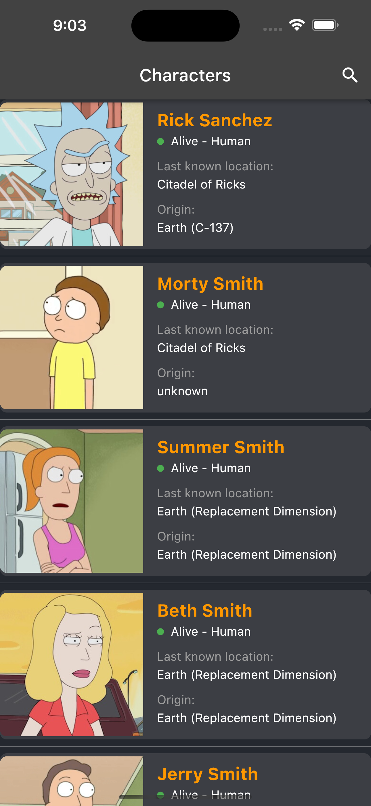
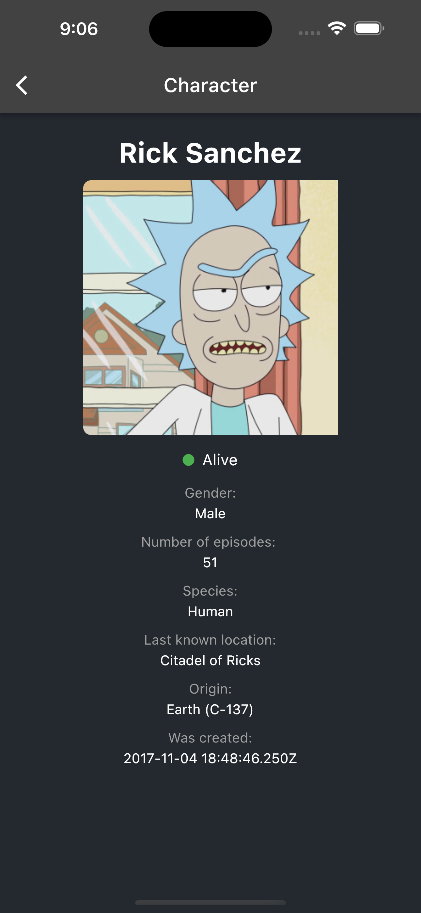

# Rick_And_Morty_App

A simple project on the theme of my favorite cartoon to explore some of the libraries and pure architecture proposed by Robert Martin.

## Preview

  

## Clean architecture diagram

## Features

- Uses [bloc/cubit](https://pub.dev/packages/flutter_bloc) as state management
- [http](https://pub.dev/packages/http)/[internet_connection_checker](https://pub.dev/packages/internet_connection_checker) for work with network
- [shared_preferences](https://pub.dev/packages/shared_preferences)/[cached_network_image](https://pub.dev/packages/cached_network_image) for local data source
- [equatable](https://pub.dev/packages/equatable) for value equality and [dartz](https://pub.dev/packages/dartz) for functional programming
